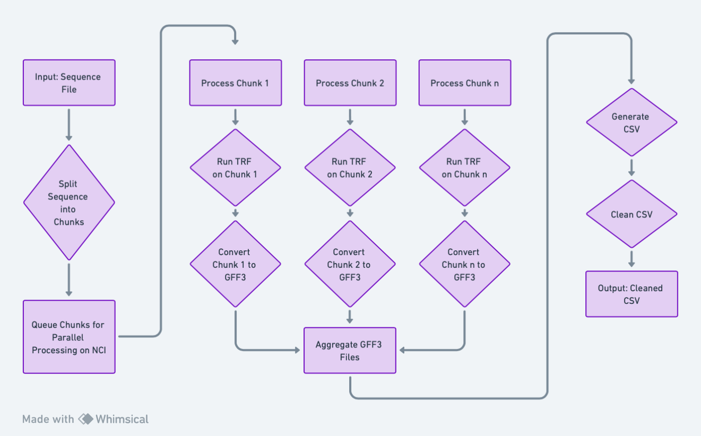

https://whimsical.com/detailed-parallelized-flowchart-for-find-telomeres-sh-2G623E2p7ubVTCZ8DGfJ4S@2Ux7TurymNGkJUXCfVvk

## Find Telomeres Script

This script is designed to identify telomeres in a given fasta sequence. It uses the Tandem Repeats Finder (TRF) to detect telomeric repeats and then processes the results to generate a CSV file with the identified telomeres.

# Usage

To use this script, submit it to a job scheduler with the required parameters:

``` 
qsub -l storage=gdata/if89+gdata/projectcode -o /path/to/stdouterr -P projectcode -v input=/path/to/fasta,output=/path/to/output/csv,permatch=90,copies=100 ./find_telomeres.sh

```
Parameters 
input: Path to the input fasta file.
output: Path to the output directory where the CSV file will be saved.
permatch: Percentage match for the telomeric repeats.
copies: Number of copies of the telomeric repeat.
Dependencies

The script requires the following modules:

kentutils
TRF (Tandem Repeats Finder)
biopython
parallel
Additionally, it uses a Python script trf2gff.py to convert TRF output to GFF3 format and another Python script clean_telomere_csv.py to process the results.

Output

The script generates a CSV file with the following columns:

Sequence_ID
Start
End
ID
period
copies
consensus_size
perc_match
perc_indels
align_score
entropy
cons_seq
repeat_seq
Notes

Ensure that the required storage paths are correctly specified when submitting the job. The script splits the input fasta file into chunks, processes each chunk in parallel, and then aggregates the results.

View the actual script

You can copy and paste the above markdown into a README.md file or any markdown viewer to see the formatted documentation.

<iframe style="border:none" width="800" height="450" src="https://whimsical.com/embed/2G623E2p7ubVTCZ8DGfJ4S@2Ux7TurymNGkJUXCfVvk"></iframe>
