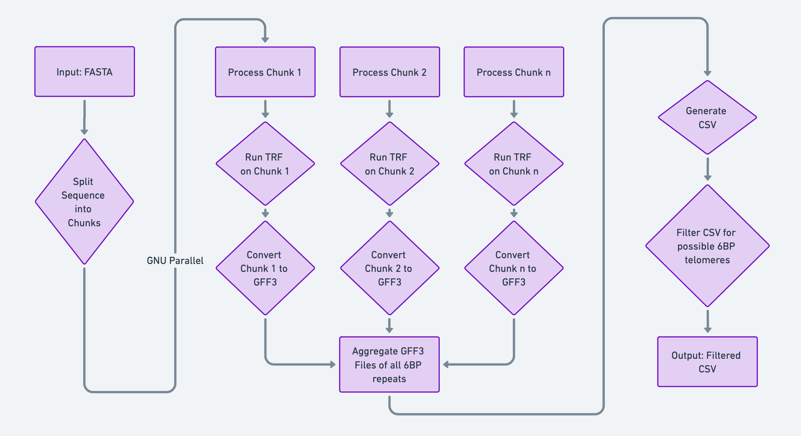
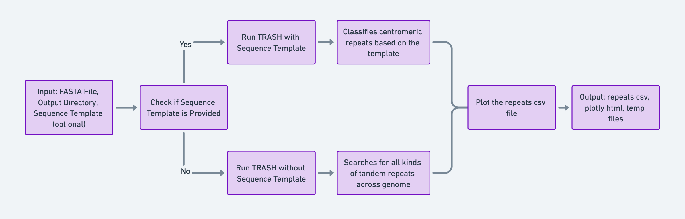
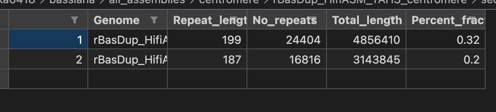
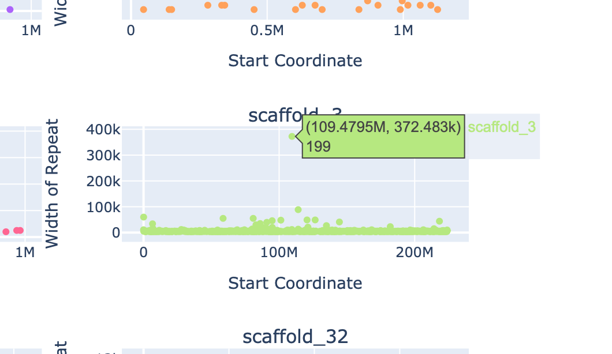
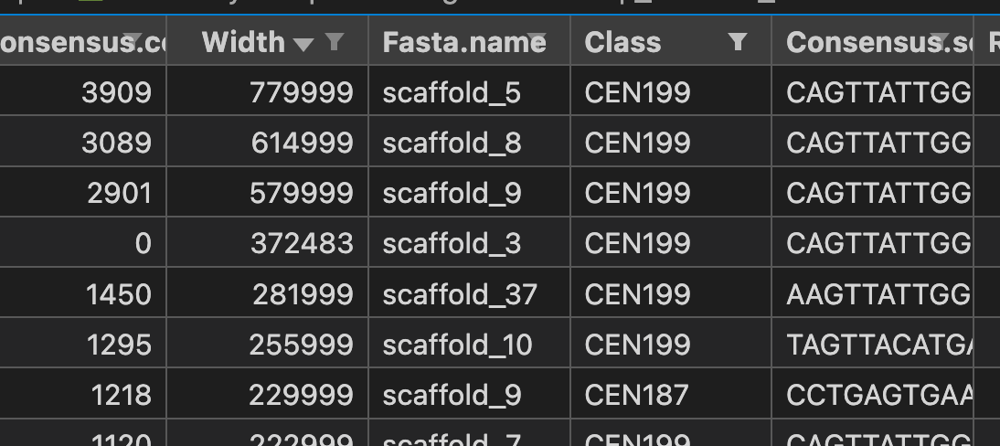

# Assembly Quality Evaluation

## find_telomeres.sh



[Flowchart link](https://whimsical.com/detailed-parallelized-flowchart-for-find-telomeres-sh-2G623E2p7ubVTCZ8DGfJ4S@2Ux7TurymNGkJUXCfVvk)

This script is designed to identify telomeres in a given fasta sequence. It uses the Tandem Repeats Finder (TRF) to detect telomeric repeats and then processes the results to generate a CSV file with the identified telomeres. The gist is that the script will find all 6BP repeats in the FASTA and then finally filter out the possible repeats based on the possible variations of TTAGGG in the forward and reverse strand. For example, the combinations are generated like GTTAGG, GGTTAG and so on. More information about how the telomeres are filtered out is in ```clean_telomeres_csv.py ```. The advantage of this script over most telomere detection tools available is that it doesn't just restrict to start/end of the sequences - but attempts to find telomeres located all over the genome. This ability makes it a good assembly evaluation measure.  

### Usage

To use this script, submit it with the required parameters:

``` 
qsub -l storage=gdata/if89+gdata/xl04+gdata/projectcode -o /path/to/stdouterr -P projectcode -v input=/path/to/fasta,output=/path/to/output/csv,permatch=90,copies=100 ./find_telomeres.sh
```

### Parameters 

- input: Path to the input fasta file.
- output: Path to the output directory where the CSV file will be saved.
- permatch: Percentage match for the telomeric repeats. The recommended setting is 90.
- copies: Minimum number of copies of the telomeric repeat. The recommended setting is 100.

### Dependencies

The script requires the following modules:

- **kentutils 0.0**
- **TRF (Tandem Repeats Finder) 4.09.1**
- **biopython 1.79**
- **parallel 20191022**
- Additionally, it uses a Python script ```trf2gff.py``` to convert TRF output to GFF3 format and another Python script ```clean_telomere_csv.py``` to process the results.

### Expected runtime 

When using 48 CPUS and 64 GB RAM - I observed runtime of anywhere from 2 hours to 5 hours for chromosome level skink assemblies. If you assembly is fragmented, the runtime decreases exponentially, since the script makes good use of GNU parallel. 

### Output

The script generates a CSV file with the following columns:

| Sequence_ID | Start | End | ID | period | copies | consensus_size | perc_match | perc_indels | align_score | entropy | cons_seq | repeat_seq | relative start | relative end |

Most of the output columns are self-explanatory, however I added the ```relative start``` and ```relative end``` columns for understanding where the telomeric sequences are located in each contig. They are just ``` telomeric start or end coordinate \ total length of contig ```. So, if the value is 0 - that means the telomere occurs at the start and similarly 1 indicates the end. In draft assemblies you might observes values like 0.3, 0.5 which indicates the telomeres lie in the 30%/50% positions. 

## centromeres.sh 



[Flowchart Link](https://whimsical.com/flowchart-for-centromeres-sh-9j33qnt46GwyWcbSCUA9Jz)

The centromeres.sh script is designed to predict centromeres in a given FASTA file. It is basically the wrapper for the TRASH tandem repeat finder tool and has to be run in two steps for the best results. When you run it for the first time, it will output all kinds of tandem repeats found throughout the genome. After analysis, it should be run for the second time with a sequence template (described in notes section below) for a classification of centromeric repeats. 

### Usage

qsub -l storage=gdata/if89+gdata/xl04+gdata/projectcode -o /path/to/stdouterr -P projectcode -v inputfasta=test.fasta,outputdir=/path/to/output,template=cen.csv ./centromeres.sh

### Parameters

- **inputfasta** : your FASTA/reference genome
- **outputdir** : the directory to save the final and temporary files
- **template** : a csv file containing a sample name, length and sequence for centromeric repeats. 

### Dependencies

 - **Conda environment trash** : has all the dependencies required by TRASH tool. As long as you run using the usage instructions, don't worry about the conda. 
 - **pythonlib** : if89 project's pythonlib 3.9.2 module, for plotly and pandas. 

### Expected Runtime

Given 48 cores and 192GB RAM - for chromosome-level skink assemblies , I have observed a runtime of around 4.5 hours. For fragmented assemblies, expect around 1.5 hours. In rare cases I have seen it running out of memory, which can be fixed by opting for the normalsr queue and increasing the CPU and RAM numbers to 104 and 512 respectively. 

### Output

- **Summary.of.repats.*.csv file** : the csv file of interest for downstream analysis 
- **.centromeres_plotly.html** : plotly visualisation of the above csv file for centromeric repeat identification
- Numerous temporary files, a folder of plots, etc 

### Notes

Here is a set of instructions to follow for this workflow
- After you run TRASH, you will find a folder called "plots" which has a plot named *_peaks_m.png and a csv called *_peaks.csv. These files tell you the identified centromeric repeats in the genome. For example, I  found that my peaks were found at 187 and 199 bp. 



- Open the *.centromeres_plotly.html and analyse the individual plot for every contig. The plots are repeat width vs start coordinate, and hovering on the plot will reveal the motif length of any given point. What you should be looking for is an outlier point which stands out from the rest of the repeats, and these will usually be your centromeres, having a similar motif length to those mentioned in the peaks csv file. 



- After you confirm the centromeric repeat motifs through the peaks file and the plotly visualisation, prepare a sequence template file. 

- Open the Summary.of.repeats.*.csv in excel and sort the file by the width column in descending order. Here, the "most.freq.value.N" is the motif length and "consensus.primary" is the motif sequence. The aim for the sequence template is to find a highly-probable motif sequence for each possible centromeric repeat family. For example, as soon as I sorted by the width, I found that the top entries were mostly similar to 187 and 199 motif lenfths. Even if the motif lengths are close to the peaks - like 186-190 instead of 187, that is absolutely fine. Grab one motif sequence for each of your predicted peak/repeat families and make a csv file in the format given below.  

| name | length | seq |
| ---- | ------ | --- |

- You can use any name you like, it is recommended to follow the convention and use the CEN+Length format - but doesn't make a difference. Enter the length and any one seq of that length/similar from the Summary of repeats file. 

- Provide this csv to the centromeres.sh script for the second run, and now your Summary of repeats csv will contain a column called "class" which would have classified your repeats according to the template you supplied. You will notice that repeats having similar motif lengths to the provided template motif lengths will all be assigned to a single family. This step basically uses sequence similarly to classify the repeats. Now, you can use this new repeats csv for downstream analysis and plotting. 




